## Module 5

### Before Optimizing

Endpoint /all-student
- JMeter GUI
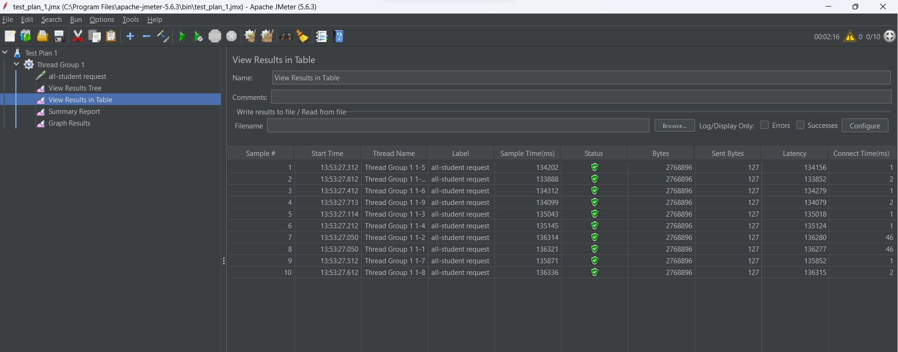
- JMeter CLI
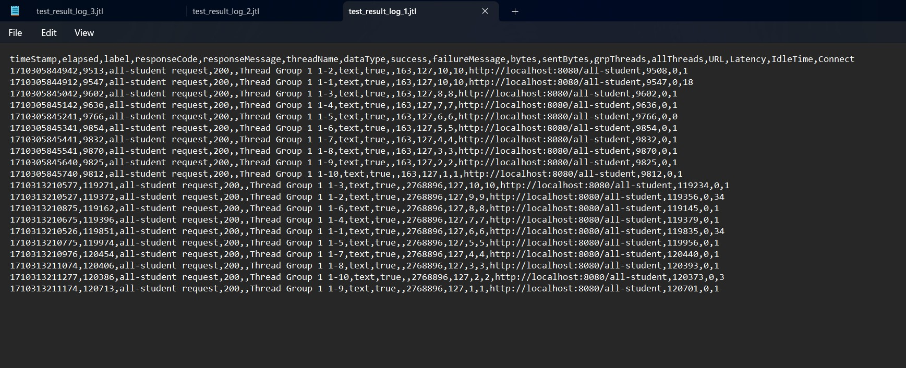
- IntelliJ Profiler
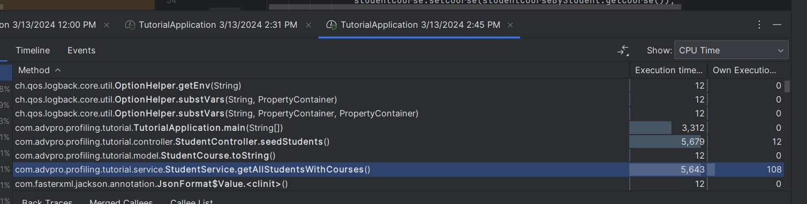

Endpoint /all-student-name
- JMeter GUI
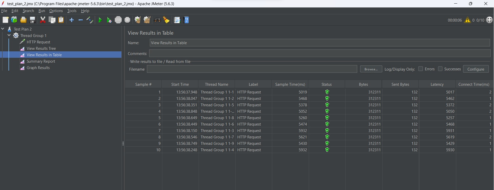
- JMeter CLI
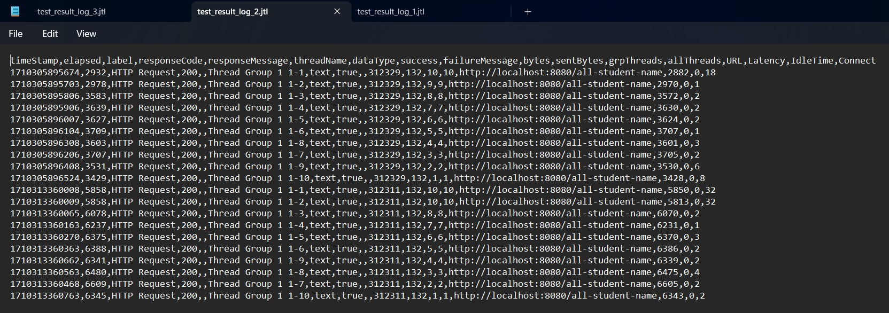
- IntelliJ Profiler
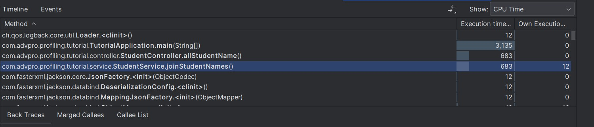

Endpoint /highest-gpa
- JMeter GUI

- JMeter CLI
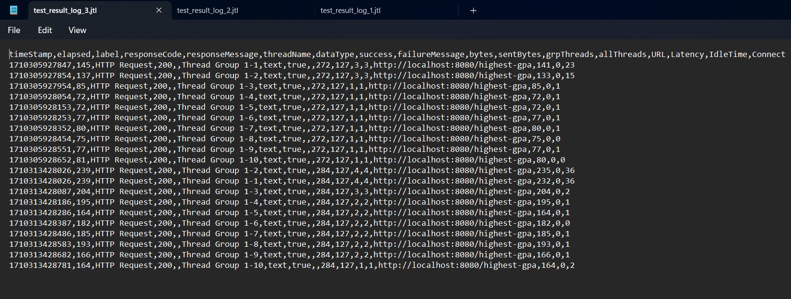
- IntelliJ Profiler
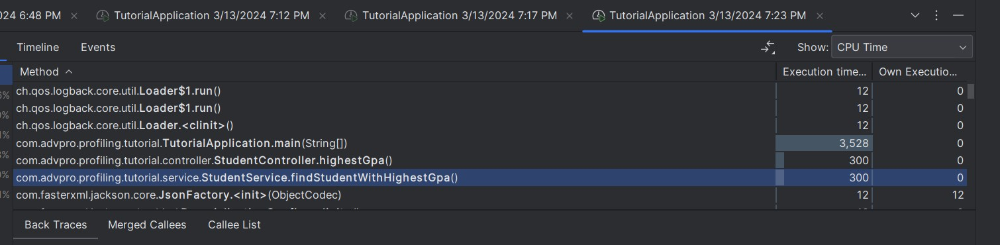

### After Optimizing

Endpoint /all-student
- IntelliJ Profiler
Terdapat efisiensi dalam segi waktu dibandingkan pengukuran sebelum refactor. 
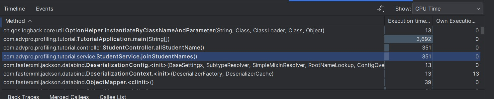

Endpoint /all-student-name
- IntelliJ Profiler
Terdapat efisiensi dalam segi waktu dibandingkan pengukuran sebelum refactor. 
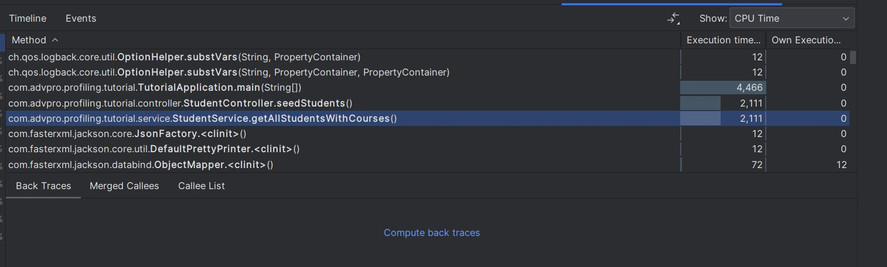

Endpoint /highest-gpa
- IntelliJ Profiler
Terdapat efisiensi dalam segi waktu dibandingkan pengukuran sebelum refactor. 
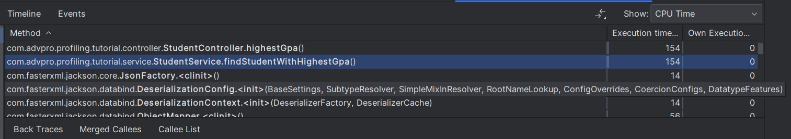

### Refleksi
1. Perbedaan antara JMeter dengan IntelliJ Profiler adalah kemampuan IntelliJ Profiler yang dapat memberikan berbagai data, seperti tingkat penggunaan CPU, heap, hingga waktu yang dibutuhkan. JMeter hanya menunjukan waktu eksekusi dari setiap test saja.

2. Profiling memiliki berbagai fitur untuk menunjukkan tingkat efisiensi kode yang ditunjukan oleh berbagai variabel seperti penggunaan CPU, heap, waktu eksekusi yang ditampilkan dalam berbagai bentuk seperti method list dan flame tree.

3. IntelliJ Profiler sangat berguna untuk mengukur bottleneck karena IntelliJ Profiler dapat menunjukan secara detail bagian kode yang memiliki waktu eksekusi yang lama.

4. Kesulitan yang saya hadapi dalam melakukan profiling adalah pengalaman saya yang masih sedikit dalam melakukan profiling, sehingga belum terbiasa menggunakan fitur-fitur yang ada pada IntelliJ Profiler, seperti flame tree yang awalnya cukup membingungkan saya dalam membacanya.

5. Saya bisa melihat secara merinci setiap waktu eksekusi dari program, sehingga saya bisa mengetahui kode apa yang mengakibatkan waktu eksekusi yang lambat. Saya juga bisa mengetahui kode apa yang menggunakan CPU dan heap paling banyak.

6. Saya mencoba untuk melakukan profiling ulang agar program dapat berjalan lebih optimal seperti yang dijelaskan pada modul.

7. Saya menyalakan program profiling yang ada di IntelliJ, kemudian saya melihat kode bagian mana yang memiliki waktu eksekusi paling lama dibandingkan yang lainnya. Saya pun membuat setiap kode menjadi lebih efektif dengan menggunakan function yang lebih efektif dan menggunakan StringBuilder yang lebih cepat diubah (karena mutable) dibanding String yang imutable. Saya pun kembali melakukan profiling kembali dan menguji apakah perubahan yang dilakukan mengakibatkan percepatan pada waktu eksekusi dan berfungsi dengan baik dengan melakukan HTTP request dengan Postman.